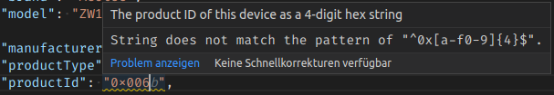

# Authoring firmware definition files

## Directory structure

The files belong into the `firmware` directory, organized by manufacturer or brand. The following naming schemes are suggested:

```
firmwares/<brand>/<model>[_<version-or-range>].json
firmwares/<manufacturer_name>/<brand>_<model>[_<version-or-range>].json
```

where `<brand>` and `<model>` should be relatable to the corresponding entries in the JSON files. `[_<version-or-range>]` is optional (denoted by the square brackets) and should only be present for files that apply to a subset of firmware versions.
Filenames should not contain spaces or any special characters and they MUST end in `.json`.

For example:

```
coolio/z-dim7.json
coolioproducts/coolio_z-dim7_1.1-1.6.json
```

## File format

When using VSCode, the files will automatically be validated against a JSON Schema. This way you can spot errors directly while working on them:

<p align="center">
	
</p>

### Defining which devices a definition file applies to

Each `"devices"` entry defines a single device for which this file contains the available firmware updates. A file can contain on or more of these entries:

```jsonc
{
	"devices": [
		{
			// Definition for device #1

			// The brand and model are used to display the information to end users
			// and allow them to double-check
			"brand": "Coolio",
			"model": "Z-Dim 7",

			// These fields are the ones returned by Manufacturer Specific CC
			// and they are required to identify a device
			"manufacturerId": "0x1234",
			"productType": "0xabcd",
			"productId": "0xcafe",

			// The firmware version range is optional, the default is 0.0 - 255.255
			// (matches all CURRENT firmwares)
			// This can be used to split the definitions into multiple files

			// The `firmwareVersion` field may also contain a patch version, e.g. `1.6.1`.
			// When no patch version is provided, it will be assumed to be `0`,
			// so `1.6` is equivalent to `1.6.0`.
			"firmwareVersion": {
				"min": "0.0",
				"max": "255.255"
			}
		},
		{
			// ... definition for device #2
		}
	]

	// Rest of the file
}
```

### Defining the possible upgrades for a device

Each entry in `"upgrades"` defines a single available firmware update for ALL devices matched by the above rules. A file can contain on or more of these entries.

```jsonc
{
	"devices": [
		// ...
	],

	"upgrades": [
		{
			// The version field MUST indicate the version of the NEW firmware
			"version": "1.7",
			// The changelog field will be displayed to the user and is purely informational
			"changelog": "* Fixed some bugs\n*Added more bugs",

			// Optionally define the target chip this upgrade is for.
			// If not defined, target 0 will be assumed
			"target": 0,

			// The url MUST point to a publicly downloadable file in one of the supported
			// formats, e.g. ota, otz, hex, hec, gbl, etc.
			// Z-Wave JS will download this in the background when doing an upgrade.
			"url": "https://example.com/firmware/1.7.otz",
			// The integrity field contains a hash of the the raw firmware data as a
			// hexadecimal string and is used to verify that the correct file was downloaded.
			// The prefix indicates the hash algorithm, e.g. "sha256:" for SHA256.
			// At the moment, only SHA256 is supported.
			"integrity": "sha256:cd19da525f20096a817197bf263f3fdbe6485f00ec7354b691171358ebb9f1a1"
		}
		// ... more firmware updates for the same file
	]
}
```

The changelog MUST NOT be a link. Instead, the changelog text MUST be included in the upgrade definition. It MUST be plaintext or Markdown, encoded so it is a valid JSON string. This is easiest if you use our [Changelog Helper Utility](https://zwave-js.github.io/firmware-updates/).

The integrity hash must be generated using the raw firmware data as it will be transferred to the device. If the firmware file is Intel HEX encoded or similar, this must be the hash of the **decoded** data. We've provided a small utility to do this for you, which just requires [Node.js](https://nodejs.org/en/download/) 16.9 or newer to be installed. Then you can run one of the following commands (replace `<url>` or `<file>` with the URL or path to the file):

```sh
npx @zwave-js/firmware-integrity <url>
npx @zwave-js/firmware-integrity <file>
```

and the tool will output the integrity string. More information can be found at https://github.com/zwave-js/firmware-integrity.

### Provide access to betas or pre-releases

The optional `"channel"` field is used to assign an upgrade to a specific release channel:

-   `"stable"`: Production-ready, well-tested firmwares. This is the default if the channel is not specified.
-   `"beta"`: Beta or pre-release firmwares.

```jsonc
{
	"devices": [
		// ...
	],

	"upgrades": [
		{
			"version": "1.7",
			"changelog": "* Fixed some bugs\n*Added more bugs",

			"channel": "beta"
			// ...
		}
	]
}
```

This allows more experienced users to stay up to date with the latest versions, while others can stick to well-tested firmwares.

> **Note:**
> The `beta` channel is **not** intended to distribute nightly or testing builds. These firmwares MUST be stable enough for a public, potentially wide-spread release.

### Region-specific firmware upgrades

If there are different region-specific firmwares for the same device, the upgrades can be limited to a region using the `"region"` field, which can have the following values:

-   `"europe"`
-   `"usa"`
-   `"australia/new zealand"`
-   `"hong kong"`
-   `"india"`
-   `"israel"`
-   `"russia"`
-   `"china"`
-   `"japan"`
-   `"korea"`

Example:

```jsonc
{
	"devices": [
		{
			// All devices share this identification, regardless of region:
			"manufacturerId": "0x1234",
			"productType": "0xabcd",
			"productId": "0xcafe"
			// ...
		}
	],

	"upgrades": [
		// Upgrades/firmware are limited to a specific region
		{
			"version": "1.7",
			"region": "europe",
			"changelog": "Comply with EU regulations"
			// ...
		},
		{
			"version": "1.7",
			"region": "usa",
			"changelog": "Comply with US regulations"
			// ...
		}
	]
}
```

> **Note:**
> These region-specific updates will **only** be offered if the request also contains a matching `region` field, which requires support from both the client software and the user's Z-Wave controller.
>
> If devices for different regions can be distinguished otherwise, e.g. through different `productType`s per region, the `region` field should **NOT** be used.

### Multiple firmware upgrades

Devices with multiple firmware targets can define multiple downloads in a single entry. The downloads should appear in the order they are meant to be applied.

```jsonc
{
	"devices": [
		// ...
	],

	"upgrades": [
		{
			"version": "1.7",
			"changelog": "* Fixed some bugs\n*Added more bugs",

			"files": [
				// Update chip 1 first
				{
					"target": 1,
					"url": "https://example.com/firmware/1.7_target1.otz",
					"integrity": "..."
				},
				// then chip 0
				{
					"target": 0,
					"url": "https://example.com/firmware/1.7_target0.otz",
					"integrity": "..."
				}
			]
		}
	]
}
```

### Offer upgrades conditionally

Each entry can further limit the conditions under which it is applicable. Non-matching upgrades will not be offered.

The syntax is the same as in https://zwave-js.github.io/node-zwave-js/#/config-files/conditional-settings?id=conditional-configuration-settings

For example, the following upgrade only applies if the device currently has firmware 1.1 - 1.6 and the product ID `0xcafe`:

```jsonc
{
	"devices": [
		// ...
	],

	"upgrades": [
		{
			"$if": "firmwareVersion >= 1.1 && firmwareVersion < 1.7 && productId === 0xcafe",

			"version": "1.19",
			"changelog": "* Fixed some bugs\n*Added more bugs"

			// ...
		}
	]
}
```

> **Note**
> This feature should only be used when necessary, for example:
>
> -   to limit updates to a subset of the limits imposed by the `devices` entries
> -   to prevent updates from 1.x to 2.x release lines
> -   to prevent downgrades on devices that do not support being downgraded
>
> Please do not use it to impose unnecessary restrictions.

### Some more rules

The filename for each download must be provided using the HTTP-Header

```
Content-Disposition: attachment; filename="firmware.otz"
```

or included in the URL itself, e.g. https://example.com/firmware.otz.
